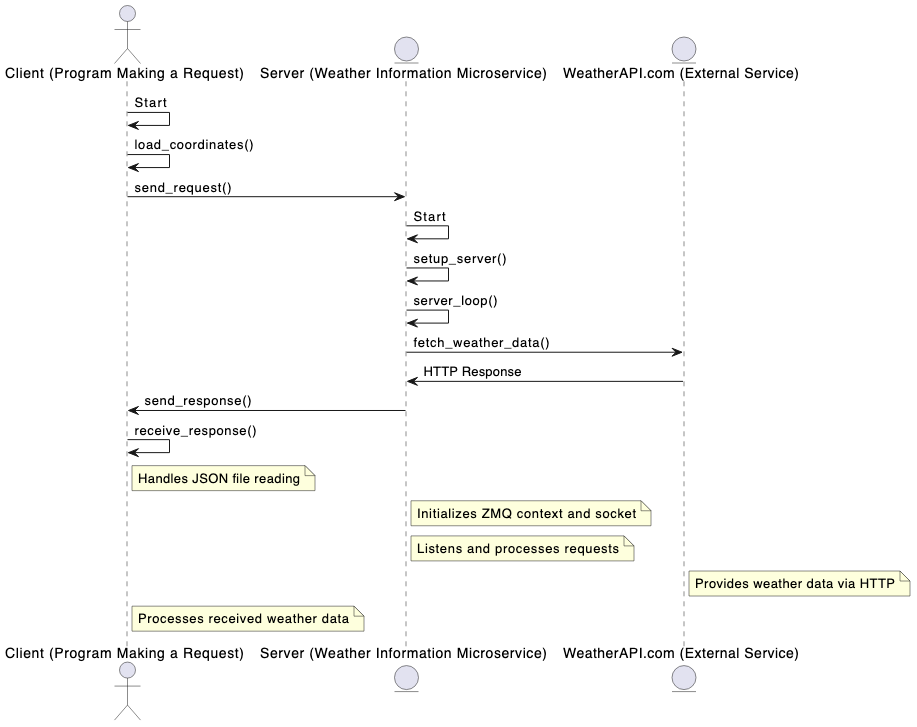

# Weather Information Microservice using ZMQ

This Python-based microservice application retrieves weather information based on geographical coordinates. It consists of two parts: a sender (client) and a receiver (server). The sender sends coordinates to the receiver, which then queries the WeatherAPI.com for current weather data and returns this data in JSON format.

## Requirements

- Python 3.11
- pyzmq: A Python wrapper for the ZeroMQ message library.
- requests: A Python library for making HTTP requests.

You can install these dependencies using pip:
```bash
pip install pyzmq requests
```
## Components

1. Sender (Client):
   - Sends coordinates to the receiver.
   - Receives and prints the weather data response.

2. Receiver (Server):
   - Listens for incoming coordinates.
   - Fetches weather information using the WeatherAPI.
   - Returns the weather data to the sender.

## Setup and Execution

1. Running the Receiver (Server):
   - Navigate to the directory containing the server script.
   - Run the script: python receiver.py

2. Running the Sender (Client):
   - Navigate to the directory containing the client script.
   - Run the script: python sender.py
   - Input the coordinates when prompted.


